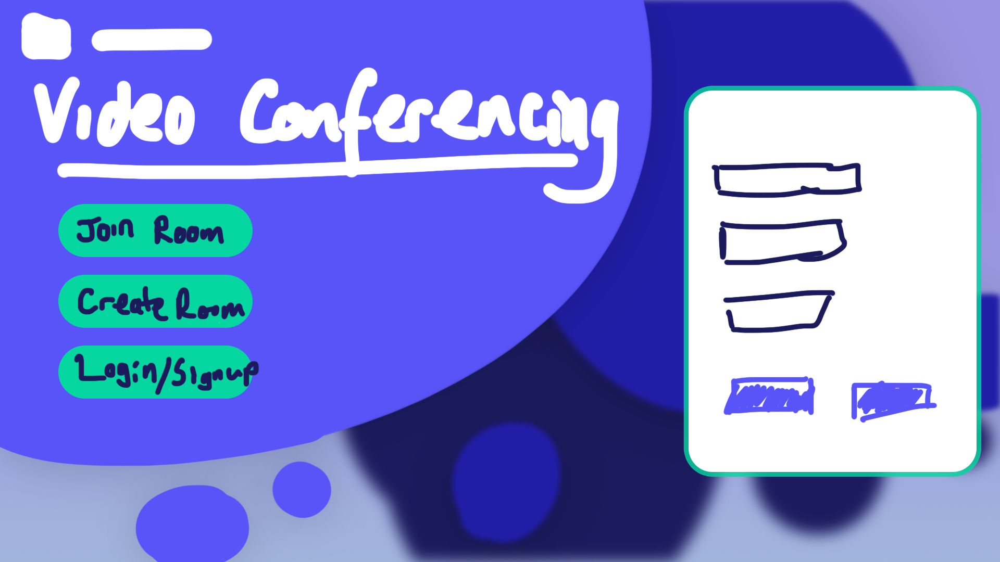

# Log 4 - 07/02/2022
Last week was spent working on the preliminary report for the project. During that time I set up the demo server and client in a lab and had multiple users join the conference.

*Demo with 6 users in the lab*

---
## Project Timeline

While writing up the preliminary report I set out a time line for the project as follows:

Format: 
`{Task Name} ({Duration in Weeks}) [{End Date}]`

Starting 25/01/2022: 
- Initial research and learning (2 Weeks) [06/02/2022]
- UI design and implementation (3 Weeks) [27/02/2022]
- STUN and TURN server configuration (2 Weeks) [13/03/2022]
- Authentication and login (3 Weeks) [03/04/2022]
- Testing and changes (2 Weeks) [17/04/2022]
- Report write up (3 Weeks) [08/05/2022] 

---
## Web Page Design

After beginning work on the project itself again today, I started with UI design. I began by mocking up the design in Photoshop using a number of references and [my previous notes](../jan/26012022.md)

*Landing Page Examples*

What I gathered from these designs was that landing pages tend to consist of a large background image, with a title, a subtitle or short description and a high contrast button to take the user further into the site.

I really liked the large blue cicrle design of the talkspace landing page, and the artistic background of the ExpressVPN landing page. I started by creating a background fitting the circular theme and faded into a background by increasing the colour darkness and blurring the shapes to show depth, this can all be done in the browser using svgs with the `feGaussianBlur` filter.

I had hopped to then add a very slight parallax effect to the background on mouse movement to give the illusion of depth as in this example:

*Parallax effect in the browser using JavaScript*

(In the above [example](https://codepen.io/oscicen/pen/zyJeJw) I reduced the parallaxing multiplier in all directions by a factor of 10)

Following that I positioned a place holder logo and title in the top left section, with 3 buttons one to join a room, one to create a room and one to sign in or make an account. On the right hand side I added a section which its contents would be updated to take input for the users desired operation such as joinging or creating a room. I spent quite a while settling on an accessible, high contrast colour scheme. I discuss my criteria for settling on this colour scheme later in this entry.

*Initial Landing Page Layout*

I then mocked up a mobile view of the landing page as follows:

*Mobile Landing Page Layout*

I then mocked up the room page based on previous designs seen in applications like Microsoft Teams, Zoom and jitsi.

*Room Page Layout*

After setting out these intial designs I went back and focused on the colour scheme. One of the most important aspects of a websites design is coherent, consistent use of font and colours, both in terms of accessibility and visual appeal.

I started by using https://coolors.co to contrast check my font colour against the background colours. It uses the Web Content Accessibility Guidelines (WCAG) to determine the minimum contrast.

Results:

*Chat Box Message*

*Landing Page Title*

*Landing Page Buttons*

Although the contrast on the landing page title was not so good, for large text it was sufficient and as the large title was the only place where this mix of teal and blue was used, it was kept.

Following that, I used http://www.color-blindness.com/coblis-color-blindness-simulator/ to compare the readability under different colour blind types and found that all seemed to be ok.

*Landing page presented under various colour blind filters*

However, what I came to realise after choosing an appropriate colour scheme was that the landing page, did not fit the theme of the website and a parallaxing effect may also cause difficulty or confusion for some users and may make the site inaccesible for them. I quite liked the bubble style landing page as it felt quite fun and lively, however I think for a video conferencing site a more calm, professional theme would be more appropriate. As such, keeping with the same colour scheme and room page layout, I redesigned the landing page as follows:

*Redesigned Landing Page*

This sketch was done quite roughly and quickly, however these deisgns were being created to have a starting point for development, as a guide to lay out the various html components for stlying later. The white cicles at the bottom are intended to be filled with an icon and line of text highlighting certain features of the site. 

I will discuss these designs with my supervisor tomorrow.

[Prev](../jan/28012022.md) | [Next](08022022.md)