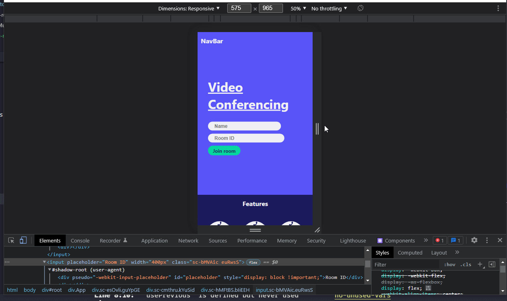

# Log 5 - 08/02/2022
Today I started work on the landing page for the site. I decided to start with this as this page will generate the room id and set the user name for the session.

I used [styled-components](https://www.styled-components.com/) to create consistent styling across the webpage components. I followed the design layout sketched at the end of [log 4](07022022.md).

I have yet to fill out the nav bar and features icons at the bottom. However, I will leave this for a later date and tomorrow focus on the room page, before implementing the funcationality on Friday.

There is some tweaking still to be done with the responsive nature of the page.

[Prev](07022022.md) | [Next](09022022.md)