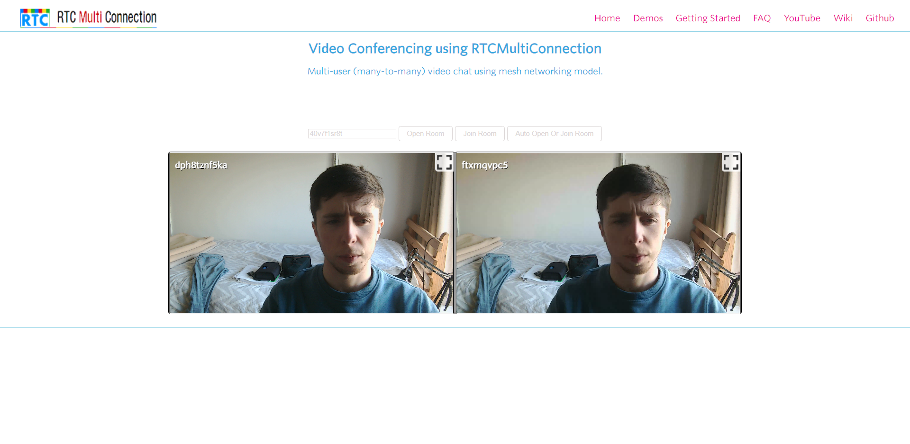
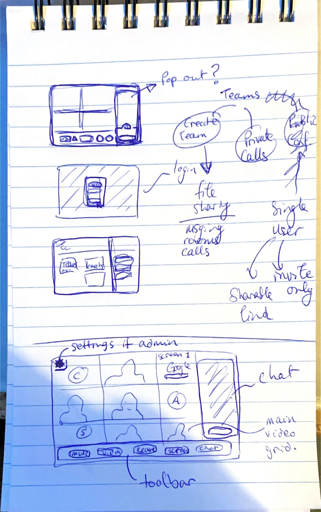

# Log 1 - 26/01/2022
I started by cloning the RTC Multiconnect repo and testing it in my broswer. I then looked at chrome://webrtc-internals to see information about the data. After a meeting with my supervisor, Dr. Miroslaw Narbutt, I found out that the main aim of the project is to create a responsive GUI on top of the WebRTC multi-connection library, rather than using the WebRTC API from scratch. He also gave me a copy of "Getting Started with WebRTC" by Rob Mason, and recommended that I take a look at https://bloggeek.me and https://webrtchacks.com

*Preliminary test of RTCMultiConnection Library*

Seeing as most of the prelimary work to be done is building a GUI on top of the existing RTCMultiConnection example code base, I focused my efforts on designing a GUI, that I will implement using React.js as it's a framework that I have previously used.

*Sketch of Preliminary Call GUI Layout*

After spening a few hours working on the project, I have realised that using React.js requires a lot of the vanilla JS example code to be rewritten to better suit the React.JS framework. Although this is quite time consuming, I'm finding that I am understanding the WebRTC code better as I reimplement it for React.JS. I will give myself 2 more days to get a working prototype using React.JS, if I cannot complete this, I'll revert back to vanilla JS and a CSS framework for consistent styling.

[Home](../../README.md) | [Next](27012022.md)

