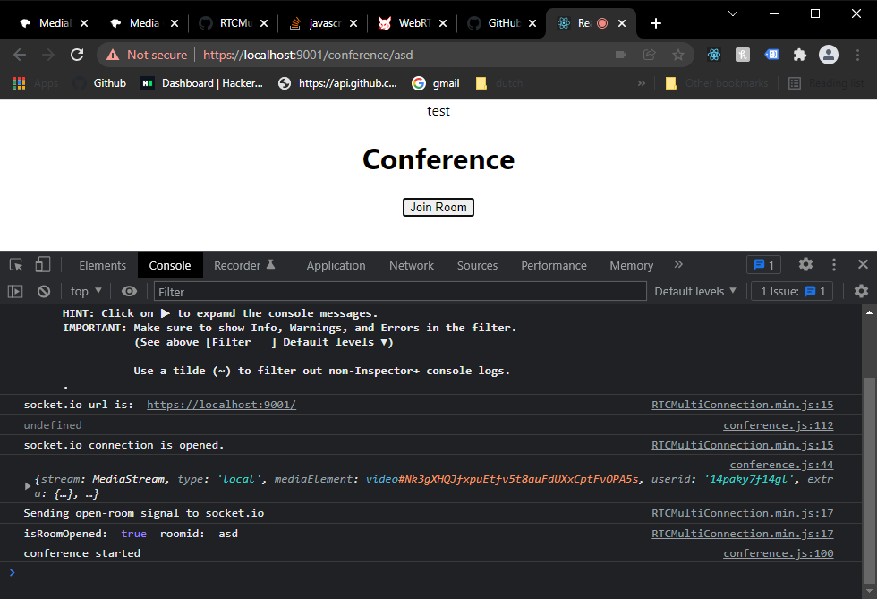

# Log 3 - 28/01/2022
This morning I set up the RTCMultiConnection library and Socket.io server with Express.js. Using this I was able to also point the Express server to my react build folder on get requests and the react app now renders correctly and connects to the socket server.

*Express back-end server and React app on front-end*

[Prev](27012022.md) | [Next](../feb/07022022.md)