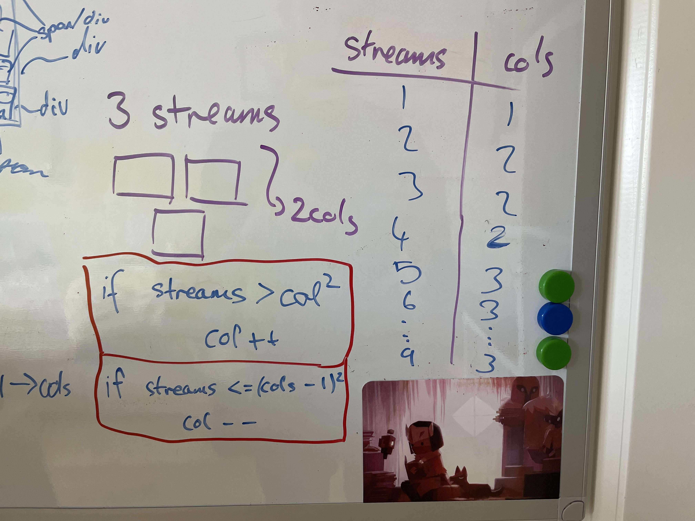

# Log 17 - 12/03/2022

Today I found a solution to the responsive grid that works... mostly. What I found was that the number of columns is determined by the square of the current number of columns compared to the number of streams. Subsequently this can be used to calculate the number of rows. However I decided to just calculate columns and divide the video grid width by the number of columns which could then be used to set the width for each one. The video heigth was also calculated in a similar way using the rows. I didnt set which videos should be on a given row however, i just set the grid to be display flex with flex wrap enabled. If the width of the grid was less than the height i just swapped the values for rows and columns. This worked quite well however it still had a few issues such as just passing the threshold between being taller than it was wide caused the streams to wrap to the next row without adjusting the video size and so the bottom streams would overflow of screen. To overcome this I think i will also try a similar method but using grid instead of flex and setting the grid template for columns and rows to be equal to "xfr" for the number of columns and rows, e.g. 3 columns = "1fr 1fr 1fr", etc.

[Prev](09032022.md) | [Next](17032022.md)